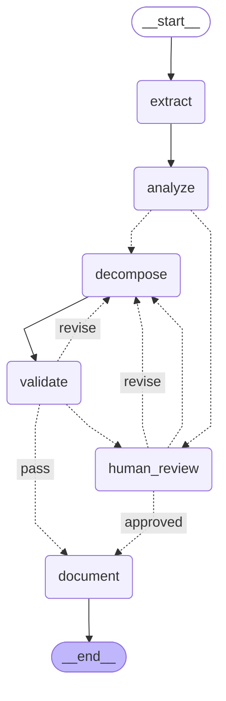

# Requirements Decomposition Workflow Graph

This diagram shows the LangGraph workflow structure for the requirements decomposition system.

## Workflow Nodes

1. **extract** - RequirementsAnalystAgent
   - Model: Gemini 2.5 Flash-Lite
   - Purpose: Parse specification documents and extract high-level requirements

2. **analyze** - SystemArchitectAgent
   - Model: Claude Sonnet 3.5
   - Purpose: Understand system context and create decomposition strategy

3. **decompose** - RequirementsEngineerAgent
   - Model: GPT-5 Nano
   - Purpose: Break down requirements into detailed, testable specifications

4. **validate** - QualityAssuranceAgent
   - Model: Gemini 2.5 Flash
   - Purpose: Score quality and enforce quality gates

5. **human_review** - Interactive CLI
   - Purpose: Human-in-the-loop review and feedback

6. **document** - Output Generator
   - Purpose: Generate final documentation and traceability matrices

## Workflow Features

- **Conditional Routing:** Flow adapts based on review flags and validation results
- **Iterative Refinement:** Validation failures trigger decomposition retry with feedback
- **Human-in-the-Loop:** Optional pre-decomposition and mandatory post-validation review
- **Quality Gates:** 0.80 threshold (configurable) with max 3 iterations

## Diagram



## How to View This Diagram

### Online (Easiest)
1. Copy the Mermaid code block above
2. Visit https://mermaid.live
3. Paste the code into the editor
4. The diagram will render interactively

### GitHub/GitLab
This file will render automatically when viewed on GitHub or GitLab.

### VS Code
Install the "Markdown Preview Mermaid Support" extension to view diagrams in preview mode.

### Mermaid CLI (Local Rendering)
```bash
# Install Mermaid CLI
npm install -g @mermaid-js/mermaid-cli

# Generate PNG from this file
mmdc -i docs/workflow_graph.md -o docs/workflow_graph.png
```

## Workflow Routing Logic

### After Analyze Node
- **If `review_before_decompose = True`:** → human_review → decompose
- **If `review_before_decompose = False`:** → decompose (direct)

### After Validate Node
- **If validation passes:** → document → END
- **If validation fails and iterations < max:** → decompose (with refinement feedback)
- **If validation fails and iterations >= max:** → human_review

### After Human Review Node
- **If human approves:** → document → END
- **If human requests revisions:** → decompose (with human feedback)
- **If human requests decompose:** → decompose

## State Persistence

The workflow uses SQLite checkpointing to persist state between runs, allowing:
- Resume interrupted workflows
- Inspection of intermediate states
- Recovery from failures

---

*Generated by `scripts/visualize_graph.py` using LangGraph's built-in visualization*
